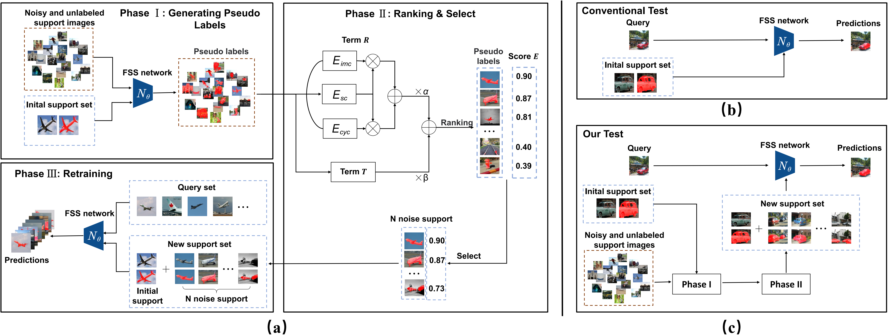
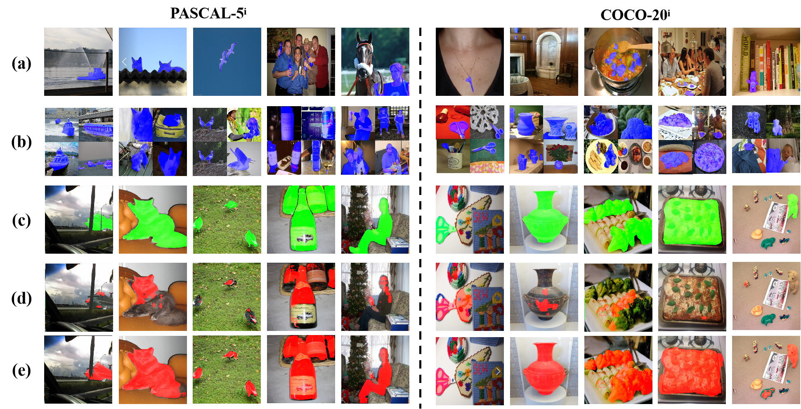

# [PR 2024] Blessing Few-Shot Segmentation via Semi-Supervised Learning with Noisy Support Images
[Runtong Zhang]<sup>1</sup>, [Hongyuan Zhu]<sup>2</sup>, [Hanwang Zhang]<sup>3</sup>, [Chen Gong]<sup>4</sup>, [Joey Tianyi Zhou]<sup>5</sup>, [Fanman Meng]<sup>1</sup> <br />
<sup>1</sup> University of Electronic Science and Techonology of China  <br />
<sup>2</sup> Institute for Infocomm Research (I<sup>2</sup>R) & Centre for Frontier AI Research (CFAR), A*STAR  <br />
<sup>3</sup> Nanyang Technological University  <br />
<sup>4</sup> Nanjing University of Science and Technology  <br />
<sup>5</sup> Centre for Frontier AI Research (CFAR), A*STAR  <br />

## Abstract
Mainstream few-shot segmentation methods meet performance bottleneck due to the data scarcity of novel classes with insufficient intra-class variations, 
which results in a biased model primarily favoring the base classes. Fortunately, owing to the evolution of the Internet, an extensive repository of unlabeled 
images has become accessible from diverse sources such as search engines and publicly available datasets. However, such unlabeled images are not a free lunch. 
There are noisy inter-class and intra-class samples causing severe feature bias and performance degradation. Therefore, we propose a semi-supervised few-shot segmentation 
framework named F4S, which incorporates a ranking algorithm designed to eliminate noisy samples and select superior pseudo-labeled images, thereby fostering the improvement
of few-shot segmentation within a semi-supervised paradigm. The proposed F4S framework can not only enrich the intra-class variations of novel classes during the test phase, 
but also enhance meta-learning of the network during the training phase. Furthermore, it can be readily implemented with ease on any off-the-shelf few-shot segmentation methods.
Additionally, based on a Structural Causal Model (SCM), we further theoretically explain why the proposed method can solve the noise problem: the severe noise effects are removed by
cutting off the backdoor path between pseudo labels and noisy support images via causal intervention. On PASCAL-5i and COCO-20i datasets, we show that the proposed F4S can boost 
various popular few-shot segmentation methods to new state-of-the-art performances. <br />


## Requirements
* Python == 3.7.12
* Pytorch == 1.10.1
* Cuda == 11.3
* Torchvision == 0.11.2
* GPU == NVIDIA Titan XP

## Visualization


## Checkpoints
Our trained model on PASCAL-5i: [OneDrive](https://1drv.ms/u/s!AlKD6m_5g-8SbpkEre1stxWyvM?e=MqBkYQ) <br />

## Training
```
python run_pascal_PR/run/ours_train/train_split0.py
```
## Evaluation
```
python run_pascal_PR/run/test/test_split0.py
```

## Citation
If you find our code or data helpful, please cite our paper:
```bibtex
@article{ZHANG2024110503,
title = {Blessing few-shot segmentation via semi-supervised learning with noisy support images},
journal = {Pattern Recognition},
volume = {154},
pages = {110503},
year = {2024},
issn = {0031-3203},
doi = {https://doi.org/10.1016/j.patcog.2024.110503},
url = {https://www.sciencedirect.com/science/article/pii/S0031320324002541},
author = {Runtong Zhang and Hongyuan Zhu and Hanwang Zhang and Chen Gong and Joey Tianyi Zhou and Fanman Meng},
keywords = {Few-shot segmentation, Semi-supervised learning, Noisy images, Causal inference},
}
```

## Acknowledgement
Our implementation is mainly based on following repositories. Thanks for their authors.
* [HSNet](https://github.com/juhongm999/hsnet)
